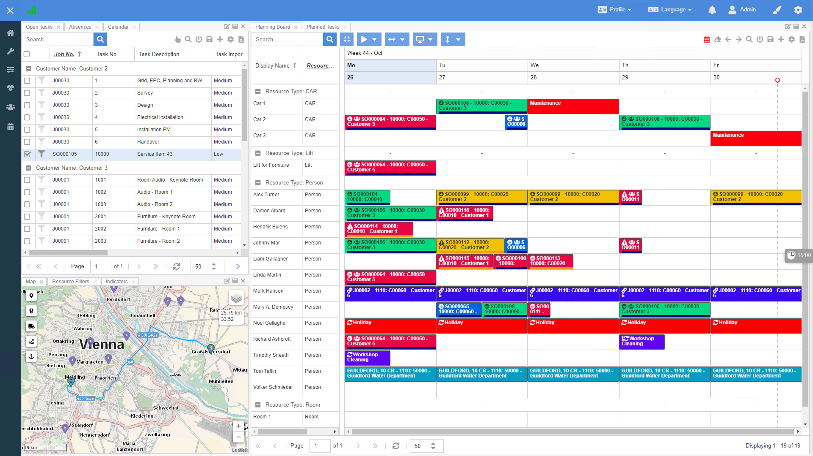
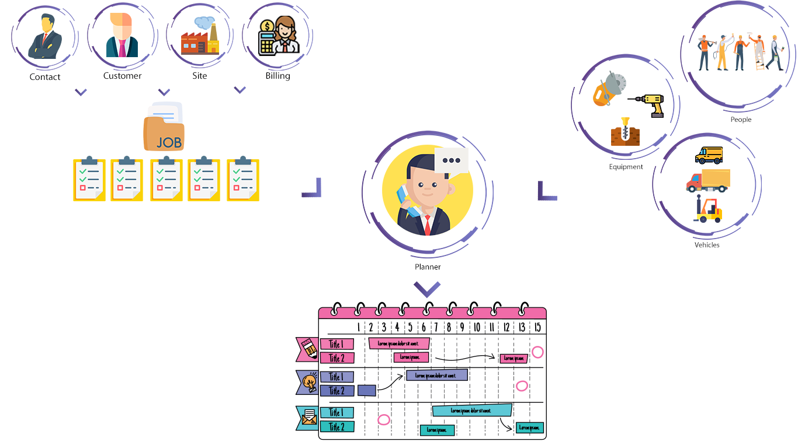

Dime.Scheduler is a comprehensive and easy-to-implement graphical planning solution that was designed to work with ERP, CRM and other LoB systems. Originally created for the Microsoft Dynamics product suite, it is architected **to work with any system** that requires an integrated resource and project planning solution.

Dime.Scheduler is driven by **back office data**. You select which entities are pushed to the planning board. Bi-directional integration synchronizes all the changes in resource allocations to the back office application and vice versa, all in real time. Any changes in your back office application can also update any appointments and their related visual markers for status, progress, or whatever you have defined.

Long story short, Dime.Scheduler aims to provide the perfect tool for the people who need to make sure that the work gets done. It is a match maker if for the resources (people, machines, and more) and the work that needs to be carried out (service jobs, production orders, etc.), if you will. This is nicely demonstrated in the visual below.

Want to learn more about the product? The [docs 📚](https://docs.dimescheduler.com) have got you covered.

