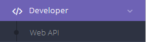
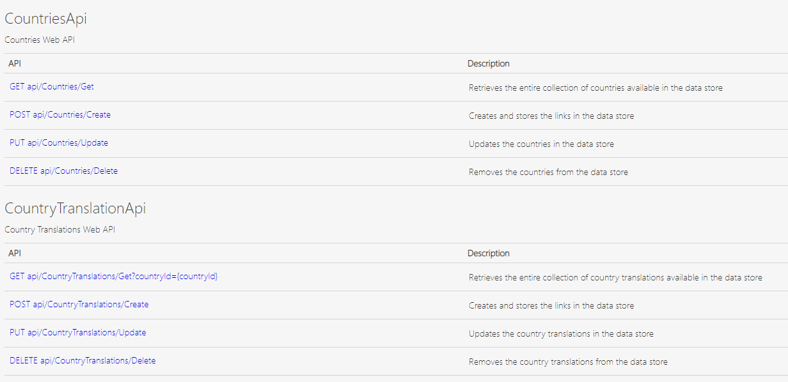

In Dime.Scheduler, there is a help section that enlists all the web APIs.

The [Dime.Scheduler docs](https://docs.dimescheduler.com/docs/en/developer-manual/developer-webapi) show how you can invoke these directly. Of course, the SDK's goal is to obfuscate such details and provide a easy to use programmatic interface to access those endpoints.

The ultimate target is to cover the entire list in the web api docs:

See the table below for the current status of this endeavour.

## Supported endpoints

| Endpoint  | Status | Version |
| --------- | ------ | ------- |
| Import    | ✅     | 1.0.0   |
| Resources | 🚧     | TBD     |
| Users     | 🚧     | TBD     |
| License   | 🚧     | TBD     |
| Message   | 🚧     | TBD     |

The import endpoint is available in the first version of the SDK, the other endpoints are expected in later versions.
