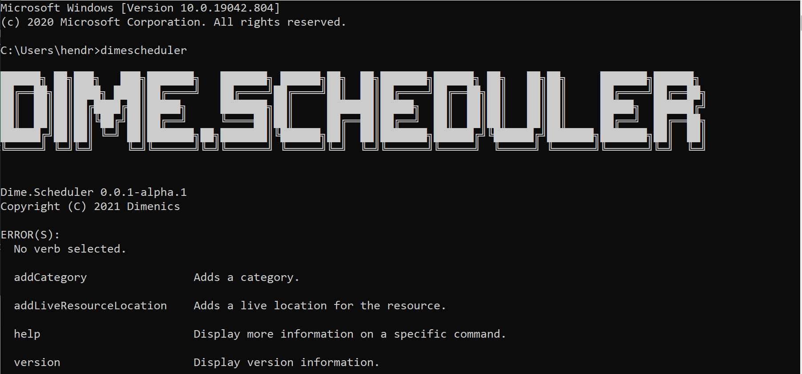

The SDK can be used in a variety of ways. For example, the Dime.Scheduler CLI is a .NET Tool that allows you to invoke the SDK through the command-line interface.

## Installation

dotnet tool install Dime.Scheduler.CLI --global --version 0.0.1-beta.latest

## Usage

The following example adds or updates a category in Dime.Scheduler:

dimescheduler addCategory
-u https://mydimescheduler.io
-c myadministrator@mydimescheduler.com
-p mystrongpassword
-n Service order status
-h #32a852
The entry point of the global tool is the dimescheduler command.

See the [repo's wiki](https://github.com/dime-scheduler/cli/wiki) for a list of all commands and their parameters.

To see the parameters of a command, simply run the dimescheduler + verb + --help command and you'll get all the information you need: