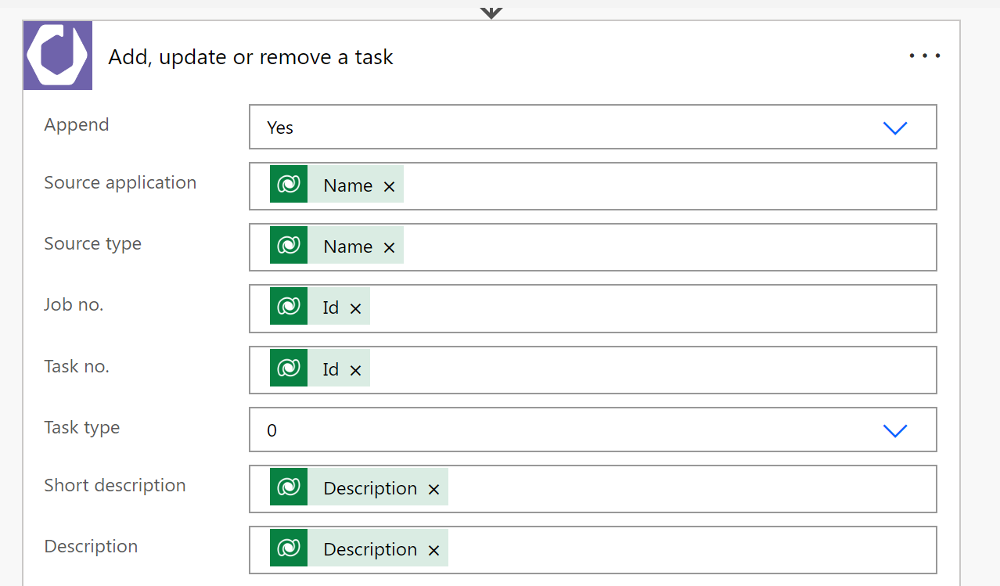

The Power Platform connector for Dime.Scheduler is pretty much a platform-specific implementation of Dime.Scheduler, which is a wrapper around the SDK, which is a wrapper around the import service. Inception, anyone?

The Power Platform connector is open source and the repo can be found [here](https://github.com/dime-scheduler/powerplatform-connector).

